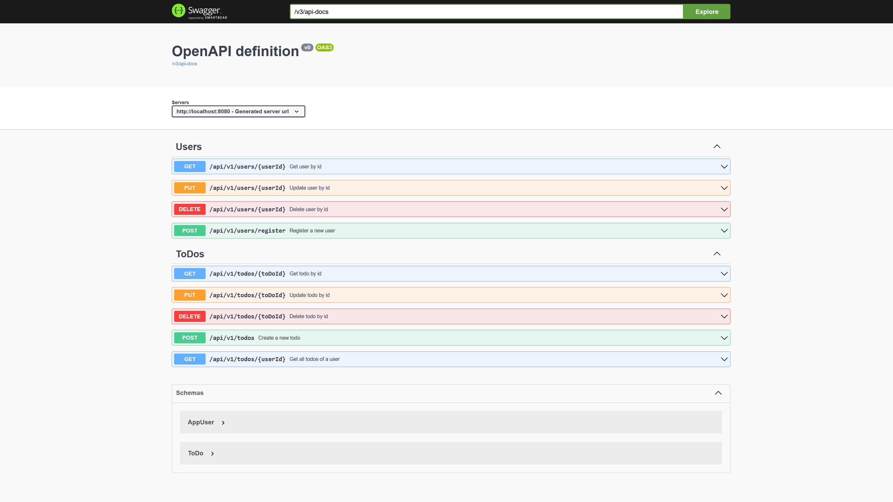

# Demo Project

## Docker database setup

### Prerequisites
- Docker and Docker Compose installed and Docker daemon running
- node and npm installed
- angular cli installed (for angular frontend)
- vue cli installed (for vue frontend)
- react cli installed (for react frontend)
- java openjdk 11 installed (for spring boot backend)

### Start the database
```bash
cd docker-mysql
docker-compose --file docker-compose-mysql.yaml up -d
```

### Shut down the database
```bash
cd docker-mysql
docker-compose --file docker-compose-mysql.yaml down
```

## Swagger URL: http://localhost:8080/swagger-ui.html



## Choose the front-end project that will be built

```xml
<configuration>
    <nodeVersion>${node.version}</nodeVersion>
    <!--workingDirectory>src/frontend-vue</workingDirectory-->
    <workingDirectory>src/frontend-angular</workingDirectory>
    <!--workingDirectory>src/frontend-react</workingDirectory-->
</configuration>
```

```xml
<configuration>
    <outputDirectory>target/classes/static</outputDirectory>
    <resources>
        <resource>
            <!--directory>src/frontend-vue/dist</directory-->
            <directory>src/frontend-angular/dist/frontend-angular</directory>
            <!--directory>src/frontend-react/build</directory-->
            <filtering>true</filtering>
        </resource>
    </resources>
</configuration>
```

## Execute maven build:

```bash
mvn clean install
```